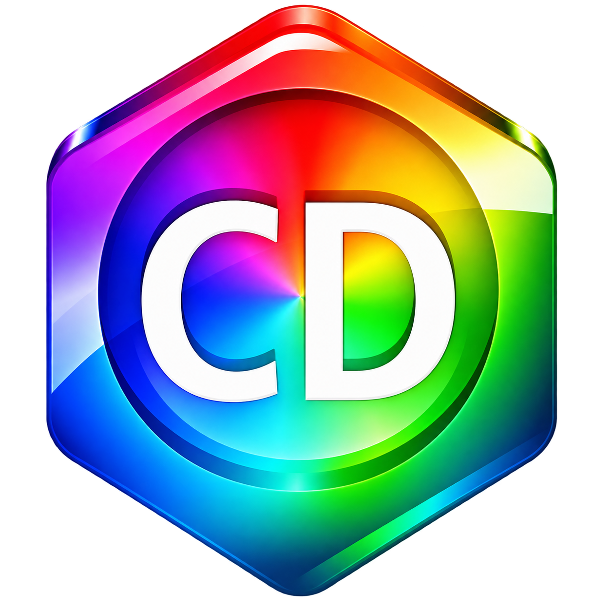

# ChemDraw Enhanced



[Download the Windows patch manager](release/ChemDrawPatchManager.exe) ·
[Download the ZIP package](ChemDraw-Native-Patcher-r107.zip)

Native Windows x64 C++ executable for the existing revision 107 rendering and
latency patches, with 20 dependency-aware feature toggles. The executable
contains the runtime DLL, MinHook license, signature catalog, and the supplied
`ChemDrawPatchLogo.png` as a seven-size Windows icon. No .NET, Python, Ghidra,
or compiler is required to use the release executable.

## Use

1. Save documents and close ChemDraw from the installation you want to modify.
2. Run `ChemDrawPatchManager.exe`, select the installation folder, and click
   **Inspect** to see the discovered function addresses and compatibility.
3. Check the desired patches and click **Apply selected**. Dependencies are
   checked automatically. Unchecking a dependency unchecks its dependent patches.
4. Open ChemDraw normally. Configuration is read when its patch DLL initializes.

**Uninstall all**, or applying an empty selection, restores the original
executable. Support files are restored to the baseline present before the first
native-manager install; files newly introduced by this manager are removed.
Existing legacy patch DLLs can remain in that baseline but are inert after the
original executable is restored. Backups are retained for recovery.

The GUI runs without elevation. An installation in a protected folder triggers
the ordinary Windows administrator prompt only for the requested write action.
**Recover** rolls back an interrupted file transaction. Recovery refuses to
overwrite files changed externally after the interrupted operation.

## Toggle boundaries

| Toggle | Purpose |
|---|---|
| GPU canvas, navigation and drag presentation | Shared GPU canvas, retained scenes, hover/hit geometry, buffering and object lifetime |
| Bounded modal tracking waits | Respond to input/deadlines in modal tracking |
| Spatial hit-test acceleration | Indexed candidate lookup |
| Rendering allocation pool | Reuse temporary native drawing nodes |
| Freeze bond placement | Commit the exact visible preview endpoint |
| Deferred placement chemistry | Batch native placement analysis at idle |
| Background chemistry workers | Isolated copies of the installation's native chemistry engine |
| Native arrows and curve editing | Snapping, native links, curve handles and ghosts |
| Smart alignment | Edge/center alignment, equal spacing and guides |
| Undo camera and empty history | Fresh history presentation and removal of empty records |
| GPU menus and refresh coalescing | Owner-drawn menus and state refresh |
| Toolbar repaint | In-place refresh and complete button frames |
| Passive history diagnostics | Bounded toolbar/history metadata log |
| Rapid Undo/Redo clicks | Ordinary press handling for native double-click messages |
| Exclude navigation from undo | Recording suppression during zoom/pan commits |
| Dismiss startup banner | Dismiss when the main window is ready; rearm timeout after bitmap publication |
| Insert molecules into reaction arrows | Split a supported shaft into two native arrows in the move transaction; Alt bypasses |
| Paired-electron reaction suggestions | Separate product preview; Ctrl+Enter accepts in one native transaction, Esc dismisses |
| Align drawing and ghost placement | Endpoint/tangent snapping, simultaneous centerline/spacing constraints and frozen click placement |
| Passive arrow insertion diagnostics | Native drag stages and insertion rejection reasons |

All optional features currently require the canvas foundation. Workers also
require deferred placement; arrows/alignment require bounded tracking waits;
rapid history clicks require toolbar handling. Coupled rendering and object
lifetime hooks are kept together to preserve their shared state invariants.
Molecule insertion requires arrows and alignment; reaction suggestions require
arrows; drawing snaps require alignment. Insertion diagnostics require insertion.
Both diagnostic toggles are off by default. Existing configuration keys retain
their bit positions; inspecting an existing installation preserves its selection,
and the newly added options can be enabled individually.

Revision 107 also includes native ring ghost geometry, molecule attachment
clearance, native-style reaction preview bond spacing, delay-loaded GPU libraries,
deferred drawing-hook installation, and demand-driven chemistry engine startup.

## Automatic discovery and version limits

141 detour targets were exported read-only from the supplied Ghidra database,
including their existing function prototypes. The manager searches executable
PE sections with patterns that mask relative branch and RIP-relative addresses.
It accepts exactly one match per target. Short identical accessors use surrounding
context. Both mixed CLR/native startup thunks are discovered by decorated idle
import names, then by their IAT references; no executable thunk offsets are
hardcoded in the release installer.

The runtime independently repeats discovery and checks loaded bytes before
installing its detours. Unknown, ambiguous or externally modified targets cause
startup to leave the shim inactive.

**This release is not universally version-invariant.** Installation is enabled
for the verified ChemDraw **26.0.0.6141 x64** private ABI profile. The existing
shim also accesses private field offsets, vtable slots, globals, direct native
calls and caller ranges. Finding a matching function signature cannot prove that
these have retained their meaning. Unknown builds can be inspected and reported,
but installation remains blocked. See `VERSIONING.md` for the remaining work
needed for automatic adoption of changed builds.

The reference profiles and mask catalog contain analysis metadata, not the
proprietary application binaries. Chemistry engine copies come from the selected
local installation.

## Files and restoration

- `ChemDraw.exe.before-latency-fix`: exact original executable; never overwritten.
- `.ChemDrawNativeBackup`: original support-file baseline with SHA-256 metadata.
- `.ChemDrawNativeTransaction`: durable rollback journal while changes commit.
- `ChemDrawLatency.native-state`: expected installed-file hashes.
- `ChemDrawLatency.ini`: selected features. Use the manager to update it;
  edits made externally deliberately cause subsequent write operations to stop.
- `%LOCALAPPDATA%\ChemDrawLatency\status.txt`: runtime activation and feature mask.

The native manager recognizes the existing legacy bootstrap on this build and
can update it. Unrelated executable modifications or vendor updates are refused.
Do not move an old original backup beside a newer vendor executable.

## Build

Requires Visual Studio C++ build tools, Windows SDK including `fxc`, and CMake.

```powershell
cmake -S . -B build -G "Visual Studio 18 2026" -A x64
cmake --build build --config Release --parallel
```

Output: `release/ChemDrawPatchManager.exe`. The runtime is built from the isolated
`runtime` source copy; the previous latency-fix and C# patcher sources are intact.

The generated signature catalog and icon are checked in, so regeneration is
optional. `ghidra/ExportPatchTargets.java` exports function boundaries/prototypes
with `-readOnly -noanalysis`; `generate-signatures.py` generates masked patterns
using Capstone from those exports and the local reference binaries.
Run `python ghidra/inventory-targets.py` before exporting to refresh the inventory
of base hooks, UI trackers, drawing callbacks and explicit resolved targets.

```text
ChemDrawPatchManager.exe --inspect <folder> <report.txt>
ChemDrawPatchManager.exe --apply <folder> <feature-mask>
ChemDrawPatchManager.exe --uninstall <folder>
ChemDrawPatchManager.exe --recover <folder>
```

CLI writes to protected folders require an elevated terminal. Feature mask bits
follow the row order above, starting at bit zero. Dependencies must be included.
CLI exits: 0 success; 1 rejected/failed operation; 2 inspection found an
unsupported build. CLI errors are written to
`%TEMP%\ChemDrawNativePatcher-error.txt`.

The Windows x64 release was compiled with Visual Studio C++ build tools. The
modified rendering features have not been exercised in a live document.

## Implementation references

- [Microsoft PE specification](https://learn.microsoft.com/en-us/windows/win32/debug/pe-format)
- [MinHook project and BSD license](https://github.com/TsudaKageyu/minhook)
- Local Ghidra exports: `ghidra/signature-catalog.json`
